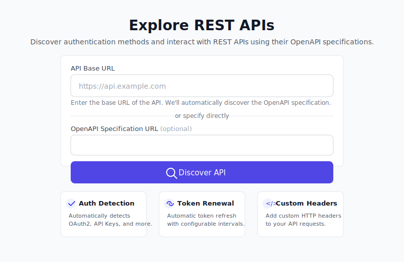
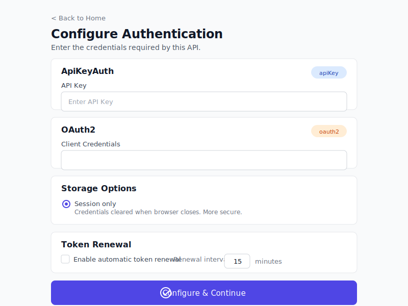

# REST Incantation

[](https://github.com/jfreed-dev/rest-Incantation/actions/workflows/tests.yml)
[](https://codecov.io/gh/jfreed-dev/rest-Incantation)
[](https://www.python.org/downloads/)
[](https://opensource.org/licenses/MIT)
[](https://github.com/astral-sh/ruff)
[](https://github.com/PyCQA/bandit)
[](https://github.com/pypa/pip-audit)
[](https://github.com/jfreed-dev/rest-Incantation/tree/main/docker)

REST Incantation is a Flask-based tool for exploring REST APIs from their OpenAPI documentation. It supports fetching OpenAPI docs from a base URL, detecting auth schemes, and guiding users through credential entry with a modern Tailwind CSS interface.

## Features
- **OpenAPI Discovery** - Automatic detection of OpenAPI/Swagger specs from 37 common paths
- **Comprehensive Authentication** - OAuth 2.0 (all flows), API Keys, Basic Auth, Bearer Tokens, JWT
- **Token Management** - Automatic renewal with configurable intervals and exponential backoff
- **Flexible Storage** - Session-only (secure) or encrypted file persistence per API
- **Custom Headers** - Add custom HTTP headers to API requests
- **Modern UI** - Clean, responsive interface with Tailwind CSS and Alpine.js

## Requirements
- Python 3.11+
- A reachable OpenAPI endpoint (or a local JSON/YAML spec file)

## Quick Start
```bash
python -m venv .venv
source .venv/bin/activate
pip install -r requirements.txt
python app.py
```

Open `http://127.0.0.1:5000` in your browser.

## Using the App
1) Enter a base API URL (for example `https://api.example.com`), or provide a direct OpenAPI URL.
2) REST Incantation will automatically discover the OpenAPI spec from 37 common paths.
3) Review detected auth schemes and enter credentials as needed.
4) Configure storage preference (session or persistent) and token renewal settings.
5) Add any custom headers required by the API.

## Authentication

REST Incantation supports all major authentication schemes defined in OpenAPI specifications:

### OAuth 2.0
All five standard OAuth 2.0 flows are supported:
- **Client Credentials** - Machine-to-machine authentication
- **Authorization Code** - User authorization with PKCE support
- **Implicit** - Legacy browser-based flow
- **Password Grant** - Direct username/password (trusted apps)
- **Refresh Token** - Automatic token refresh

### Other Auth Types
- **API Keys** - Header, query parameter, or cookie-based
- **HTTP Basic** - Username and password
- **Bearer Token** - Direct token entry
- **JWT** - JSON Web Token support

### Token Renewal
Configure automatic token renewal per API:
- Set renewal interval (e.g., every 15 minutes)
- Exponential backoff on failure (1, 2, 4, 8 min)
- Automatic disable after 5 consecutive failures

### Storage Options
Choose per API how credentials are stored:
- **Session only** - Cleared when browser closes (more secure)
- **File storage** - Encrypted with Fernet (AES-128-CBC), survives restarts

## Screenshots



## Configuration
Secrets are loaded from `config/secrets.yaml` (ignored by git). Start from the example:
```bash
cp config/secrets.example.yaml config/secrets.yaml
```

Supported keys:
- `flask_secret_key`
- `token_endpoint`
- `client_id`
- `client_secret`

You can also override the Flask secret with `FLASK_SECRET_KEY` or point to a different file with `REST_INCANTATION_SECRETS`.

## Token Helper (Client Credentials)
`bearer_tokens.py` can refresh tokens using client credentials from `config/secrets.yaml`:
```python
from bearer_tokens import get_token

token = get_token()
```

## Development

### Project Structure
```
├── app.py                 # Main Flask application
├── auth/                  # Authentication module
│   ├── schemes.py         # Security scheme parsing
│   ├── oauth2_flows.py    # OAuth 2.0 implementations
│   ├── storage.py         # Credential storage backends
│   ├── token_manager.py   # Token renewal scheduler
│   └── header_builder.py  # HTTP header construction
├── templates/
│   ├── base.html          # Base template with Tailwind
│   ├── components/        # Auth form components
│   └── partials/          # Reusable UI fragments
├── credential_method.py   # OpenAPI auth detection
└── bearer_tokens.py       # Legacy token helper
```

### Setup Pre-commit Hooks
```bash
pip install pre-commit
pre-commit install
```

Hooks run automatically on commit:
- **ruff** - linting and formatting
- **mypy** - type checking

## Testing
```bash
pytest

# With coverage
pytest --cov=. --cov-report=term
```

## Docker

### Prerequisites
- [Docker Engine](https://docs.docker.com/engine/install/) 20.10+ or [Docker Desktop](https://www.docker.com/products/docker-desktop/)
- [Docker Compose](https://docs.docker.com/compose/install/) v2.0+ (included with Docker Desktop)

Verify installation:
```bash
docker --version        # Docker version 20.10+
docker compose version  # Docker Compose version v2.0+
```

### Quick Start with Docker
```bash
# Clone the repository
git clone https://github.com/jfreed-dev/rest-Incantation.git
cd rest-Incantation

# Build and run
cd docker
docker compose up --build
```
Open `http://127.0.0.1:5000` in your browser.

### Run in Background (Detached Mode)
```bash
cd docker
docker compose up -d --build

# View logs
docker compose logs -f

# Stop the application
docker compose down
```

### Run Tests in Docker
```bash
# Using the test script
./docker/docker-test.sh

# Or manually
cd docker
docker compose run --rm test
```

### Build Only
```bash
cd docker
docker compose build
```

### Configuration with Docker
To use custom secrets, create `config/secrets.yaml` before starting:
```bash
cp config/secrets.example.yaml config/secrets.yaml
# Edit config/secrets.yaml with your values
```
The config directory is mounted read-only into the container.

## CI Checks
All checks run automatically on push and pull requests:
- **pytest** - tests with coverage reporting
- **ruff** - linting and formatting
- **mypy** - type checking
- **bandit** - security scanning

## Troubleshooting
- OpenAPI fetch fails: confirm the base URL is reachable and that `/openapi.json` or `/openapi.yaml` exists.
- Unexpected format errors: check that the spec is valid JSON/YAML and served without HTML wrappers.
- Auth schemes missing: ensure your OpenAPI spec defines `components.securitySchemes`.
- Token refresh fails: verify `token_endpoint`, `client_id`, and `client_secret` in `config/secrets.yaml`.
- Flask sessions reset: set `FLASK_SECRET_KEY` to a stable value (not the default dev key).

## Roadmap

[](https://github.com/users/jfreed-dev/projects/1)

Planned features for enterprise IT API management. Track progress on the [project board](https://github.com/users/jfreed-dev/projects/1). See [docs/VENDOR_PROFILES.md](docs/VENDOR_PROFILES.md) for detailed implementation planning.

### High Priority
- [ ] **Vendor Profile System** - Preconfigured auth endpoints, headers, and rate limits for common IT vendors (Cisco, Palo Alto, Juniper, etc.)
- [ ] **API Workflow Builder** - Visual tool to define API call sequences with variable extraction between calls
- [ ] **OpenAPI Repository Integration** - Auto-fetch specs from GitHub repos and built-in Swagger endpoints

### Medium Priority
- [ ] **Postman Collection Import** - Import existing collections from Cisco DevNet, Juniper Mist workspaces
- [ ] **Rate Limit Tracking** - Visual dashboard showing API usage with automatic backoff/retry
- [ ] **Automatic Pagination** - Handle offset/limit, cursor-based, RFC5988 Link headers, scrollId patterns
- [ ] **AWS SigV4 Authentication** - Support for AWS API request signing
- [ ] **Multi-Org/MSP Management** - Multiple organization credentials with org switcher

### Lower Priority
- [ ] **API Sequence Recorder** - Record and replay API interactions, export as documentation
- [ ] **Documentation Aggregator** - Central searchable view of vendor API documentation

### Target Vendors
Cisco (Meraki, Viptela/SD-WAN, Umbrella), Palo Alto (Prisma SASE, Strata Cloud Manager, Panorama), Juniper (Mist, Security Director), Schneider Electric (EcoStruxure IT), AWS, Microsoft Azure

## Contributing
See `CONTRIBUTING.md` for setup and PR expectations.

## Security
Report vulnerabilities per `SECURITY.md`. Do not commit secrets or `token.json`.

## License
MIT License. See `LICENSE`.
