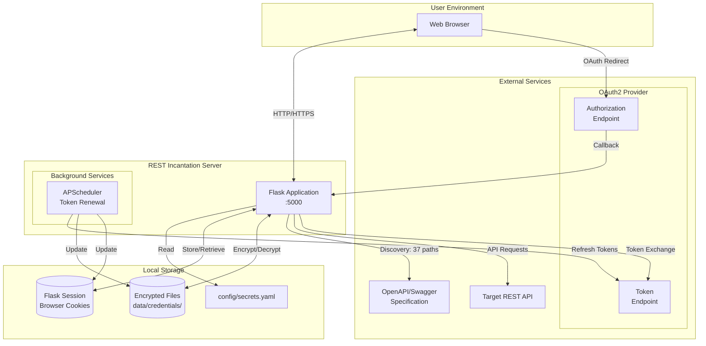
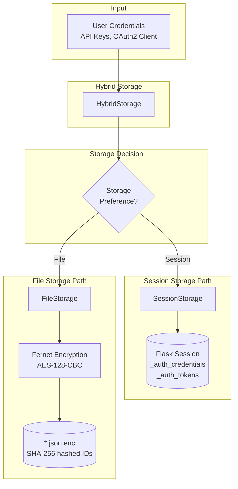
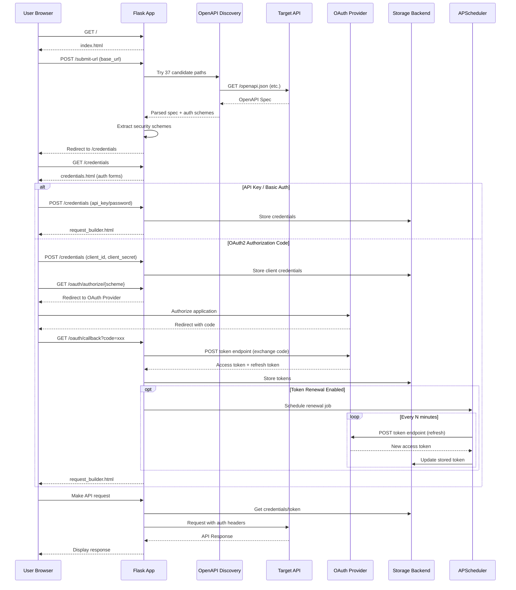

# REST Incantation Architecture

This document provides visual diagrams of the REST Incantation architecture, including network topology, data flows, and component interactions.

## System Overview

REST Incantation is a Flask-based web application that helps developers explore REST APIs by automatically discovering OpenAPI/Swagger specifications, detecting authentication schemes, and managing OAuth2 tokens.

## Network Topology



## Data Flow for Storage and Monitoring

### Credential Storage Flow



### Token Renewal Monitoring Flow

```mermaid
flowchart TB
    subgraph "Token Manager"
        TM[TokenManager]
        Config[TokenConfig]
        FailCount[Failure Counter]
    end

    subgraph "Scheduler"
        APS[APScheduler<br/>BackgroundScheduler]
        Job[Renewal Job<br/>token_renewal_{api_id}]
    end

    subgraph "OAuth2 Flows"
        Refresh[RefreshTokenFlow]
        ClientCreds[ClientCredentialsFlow]
        Password[PasswordFlow]
    end

    subgraph "External"
        TokenEP[Token Endpoint]
    end

    subgraph "Outcomes"
        Success[Success<br/>Reset counter]
        Backoff[Exponential Backoff<br/>1→2→4→8→16 min]
        Disable[Disable Renewal<br/>After 5 failures]
    end

    subgraph "Callbacks"
        CB[Renewal Callback]
        Store[Update Storage]
    end

    TM --> APS
    APS --> Job
    Job --> TM

    TM --> Refresh
    TM --> ClientCreds
    TM --> Password

    Refresh --> TokenEP
    ClientCreds --> TokenEP
    Password --> TokenEP

    TokenEP -->|200 OK| Success
    TokenEP -->|Error| FailCount

    FailCount -->|< 5| Backoff
    Backoff --> APS
    FailCount -->|≥ 5| Disable

    Success --> CB
    Success --> Store
```

## Component Interaction Diagram

```mermaid
graph TB
    subgraph "Flask Routes (app.py)"
        Index[/ index]
        SubmitURL[/submit-url]
        Credentials[/credentials]
        OAuthAuth[/oauth/authorize]
        OAuthCallback[/oauth/callback]
        RequestBuilder[/request-builder]
        RefreshAPI[/api/token/refresh]
    end

    subgraph "OpenAPI Discovery"
        FetchDoc[fetch_openapi_documentation]
        CandidatePaths[OPENAPI_CANDIDATE_PATHS<br/>37 common paths]
    end

    subgraph "Auth Module"
        subgraph "Scheme Parsing"
            CredMethod[credential_method.py]
            Schemes[auth/schemes.py]
            APIKey[APIKeyScheme]
            HTTP[HTTPScheme]
            OAuth2[OAuth2Scheme]
            OpenID[OpenIDConnectScheme]
        end

        subgraph "OAuth2 Flows"
            FlowHandler[OAuth2FlowHandler]
            AuthCodeFlow[AuthorizationCodeFlow]
            ClientCredsFlow[ClientCredentialsFlow]
            PasswordFlow[PasswordFlow]
            RefreshFlow[RefreshTokenFlow]
            ImplicitFlow[ImplicitFlow]
        end

        subgraph "Storage"
            StorageBackend[StorageBackend<br/>Abstract]
            SessionStorage[SessionStorage]
            FileStorage[FileStorage<br/>Fernet Encrypted]
            HybridStorage[HybridStorage]
        end

        subgraph "Token Management"
            TokenMgr[TokenManager]
            TokenConfig[TokenConfig]
            StoredToken[StoredToken]
            StoredCreds[StoredCredentials]
        end

        subgraph "Headers"
            HeaderBuilder[header_builder.py]
            CustomHeaders[CustomHeaderManager]
        end
    end

    subgraph "External"
        ExtAPI[External REST API]
        OAuthProvider[OAuth2 Provider]
    end

    %% Route connections
    Index --> SubmitURL
    SubmitURL --> FetchDoc
    FetchDoc --> CandidatePaths
    SubmitURL --> CredMethod
    CredMethod --> Schemes
    Schemes --> APIKey
    Schemes --> HTTP
    Schemes --> OAuth2
    Schemes --> OpenID

    SubmitURL --> Credentials
    Credentials --> OAuthAuth
    OAuthAuth --> AuthCodeFlow
    AuthCodeFlow --> OAuthProvider
    OAuthProvider --> OAuthCallback
    OAuthCallback --> AuthCodeFlow
    OAuthCallback --> TokenMgr

    Credentials --> RequestBuilder
    RequestBuilder --> HeaderBuilder
    RequestBuilder --> CustomHeaders

    RefreshAPI --> RefreshFlow
    RefreshFlow --> OAuthProvider

    %% Storage connections
    Credentials --> HybridStorage
    TokenMgr --> HybridStorage
    HybridStorage --> SessionStorage
    HybridStorage --> FileStorage

    TokenMgr --> TokenConfig
    TokenMgr --> StoredToken
    SessionStorage --> StoredCreds
    FileStorage --> StoredCreds

    %% Token manager flow connections
    TokenMgr --> FlowHandler
    FlowHandler --> AuthCodeFlow
    FlowHandler --> ClientCredsFlow
    FlowHandler --> PasswordFlow
    FlowHandler --> RefreshFlow
    FlowHandler --> ImplicitFlow
```

## Request Flow Sequence



## File Structure

```
rest-Incantation/
├── app.py                    # Main Flask application & routes
├── credential_method.py      # OpenAPI auth scheme extraction
├── bearer_tokens.py          # Legacy OAuth2 token handling
├── load_openapi_documentation.py  # Local file loader
│
├── auth/                     # Authentication module
│   ├── __init__.py          # Public exports
│   ├── schemes.py           # Security scheme parsing
│   ├── oauth2_flows.py      # OAuth 2.0 flow implementations
│   ├── storage.py           # Credential storage backends
│   ├── token_manager.py     # Token renewal scheduler
│   └── header_builder.py    # HTTP header construction
│
├── templates/               # Jinja2 HTML templates
│   ├── index.html
│   ├── submit_url.html
│   ├── credentials.html
│   └── request_builder.html
│
├── config/
│   ├── secrets.yaml         # Runtime secrets (gitignored)
│   └── secrets.example.yaml # Template
│
├── data/
│   └── credentials/         # Encrypted credential files
│
├── tests/                   # Test suite
│   ├── conftest.py
│   └── test_*.py
│
└── docker/                  # Container configuration
    ├── Dockerfile
    └── docker-compose.yml
```

## Security Considerations

| Component | Security Measure |
|-----------|------------------|
| Flask Session | Signed with `flask_secret_key` |
| File Storage | AES-128-CBC encryption via Fernet |
| OAuth2 | PKCE (S256) for authorization code flow |
| State Parameter | CSRF protection on OAuth callbacks |
| Token Storage | Encrypted at rest, preference per-API |
| Secrets | Loaded from `config/secrets.yaml` or environment |
